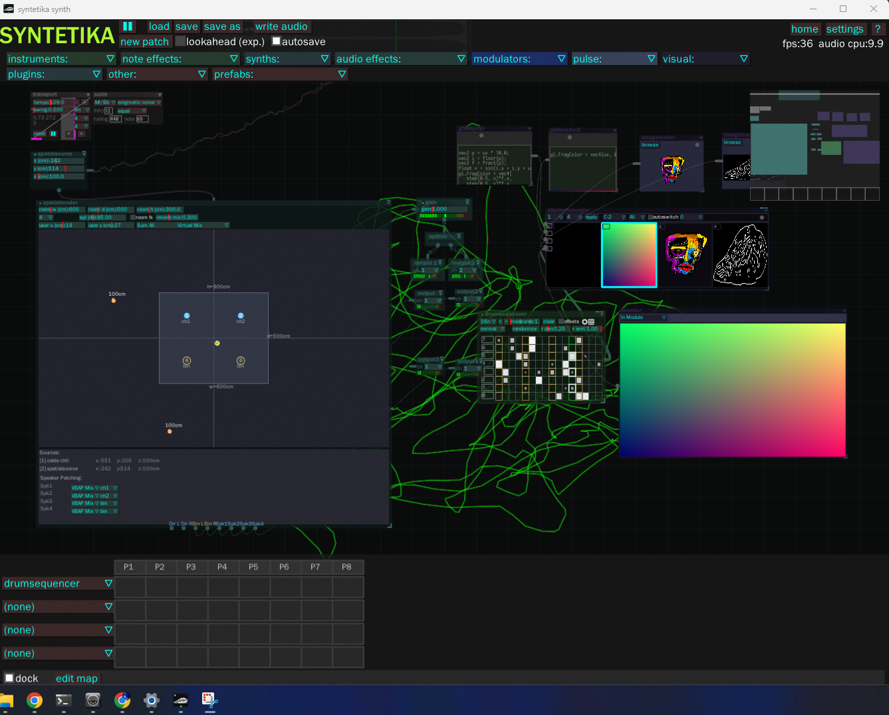

# Syntetika Studio

[](LICENSE)


[](azure-pipelines.yml)
[](https://github.com/danartriyudistira/Syntetika-Studio/releases/latest)

> **Compose Sound. Shape Space. Create Experience.**

---

## Daftar Isi

- [Tentang Syntetika Studio](#tentang-synthetika-studio)
- [Dari Audio ke Experience Composition](#dari-audio-ke-experience-composition)
- [Screenshot](#screenshot)
- [Fitur](#fitur)
- [Struktur Proyek](#struktur-proyek)
- [Persyaratan Sistem](#persyaratan-sistem)
- [Build dari Source](#build-dari-source)
- [Development Status](#development-status)
- [Open Source sebagai Fondasi](#open-source-sebagai-fondasi)
- [Lisensi](#lisensi)

---

## Tentang Syntetika Studio

Syntetika Studio berawal dari sebuah eksperimen pribadi yang saya mulai melalui proyek **[Syntetika Engine (Web Version)](https://github.com/danartriyudistira/syntetika_engine)**.

Pada tahap awal, fokus utama proyek tersebut adalah membangun sistem sequencer generatif berbasis web. Saya ingin mengeksplorasi bagaimana pola, probabilitas, dan algoritma dapat digunakan untuk menghasilkan komposisi musik secara dinamis. Syntetika Engine menjadi ruang eksperimen untuk membangun generator MIDI, sequencer generatif, dan berbagai pendekatan komputasional dalam proses penciptaan musik.

Namun seiring pengembangan berlangsung, saya mulai menyadari bahwa kebutuhan saya berkembang jauh melampaui sekadar membuat sequencer.

Sebagai seorang media artist yang bekerja di persimpangan audio, visual, ruang, dan teknologi, saya membutuhkan sebuah sistem yang tidak hanya mampu menghasilkan MIDI atau suara, tetapi juga mampu menghubungkan berbagai medium kreatif dalam satu lingkungan kerja yang terpadu.

Saya ingin sebuah trigger MIDI tidak hanya memicu suara. Saya ingin trigger yang sama dapat memanggil visual, menggerakkan objek dalam ruang, mengontrol posisi audio spasial, memicu generative graphics, atau menjadi bagian dari sebuah pengalaman audiovisual yang utuh.

Pencarian tersebut akhirnya membawa saya pada **[Bespoke Synth](https://github.com/BespokeSynth/BespokeSynth)**, sebuah modular synthesizer open-source berbasis node yang memiliki fondasi teknis yang sangat kuat untuk pengembangan sistem real-time.

Alih-alih membangun seluruh infrastruktur dari nol, saya melihat Bespoke sebagai pondasi yang ideal untuk mengembangkan visi yang selama ini saya bayangkan.

Dari titik itulah lahir **Syntetika Studio**.

---

## Dari Audio ke Experience Composition

Sebagian besar software kreatif saat ini masih memisahkan berbagai medium ke dalam aplikasi yang berbeda. Musik dibuat di DAW. Visual dibuat di software VJ. Spatial audio menggunakan sistem lain. Interaksi menggunakan sistem yang berbeda lagi.

Syntetika Studio berusaha menjembatani keterpisahan tersebut.

Bagi saya, komposisi masa depan tidak hanya berbicara tentang nada dan ritme, tetapi juga tentang posisi, gerakan, visual, ruang, dan bagaimana semuanya membentuk pengalaman yang dirasakan manusia.

Karena itu saya mendefinisikan Syntetika Studio bukan sebagai synthesizer, bukan sebagai DAW, dan bukan sebagai software VJ. Saya melihatnya sebagai:

> **Open Experience Composition Platform**

Sebuah platform terbuka yang memungkinkan kreator menyusun suara, visual, ruang, dan interaksi sebagai satu medium yang saling terhubung.

---

## Screenshot



---

## Fitur

- **Node-based architecture** — modular signal routing dengan koneksi visual real-time
- **Real-time audio processing** — engine audio performa tinggi untuk live performance
- **MIDI ecosystem** — sequencer, generative MIDI, controller mapping
- **Python scripting** — otomasi dan ekstensi via pybind11
- **Ableton Link** — sinkronisasi tempo dengan Ableton Live dan software lain
- **VST2 support** — gunakan plugin VST favorit (non-FOSS build)
- **Microtonal tuning** — dukung berbagai sistem tuning via tuning-library
- **Cross-platform** — Windows, macOS, Linux

Visi jangka panjang:

```
Audio Nodes    Visual Nodes    Spatial Nodes    Motion Nodes    Utility Nodes
```

Suara, visual, ruang, dan pergerakan diperlakukan sebagai objek yang setara dalam satu graph.

---

## Struktur Proyek

```
syntetika-studio/
├── Source/              # Kode sumber utama aplikasi
│   ├── cmake/           # CMake helper scripts
│   └── CFMessaging/     # macOS CoreFoundation messaging
├── libs/                # Third-party dependencies (git submodules)
│   ├── JUCE/            # GUI & audio framework
│   ├── pybind11/        # Python bindings
│   ├── jsoncpp/         # JSON parsing
│   ├── ableton-link/    # Ableton Link sync
│   ├── tuning-library/  # Microtonal tuning
│   ├── exprtk/          # Expression parsing
│   ├── nanovg/          # Vector graphics
│   └── ...
├── resource/            # Fonts, tooltips, help text, noise textures
├── build/               # Build output (CMake-generated)
├── scripts/             # Installer scripts (Linux, macOS)
├── syntetika_windows_installer/  # Windows installer (WiX)
├── autodoc/             # Auto-documentation tooling & website
├── dist/                # Distribution output
├── CMakeLists.txt       # Root CMake configuration
├── azure-pipelines.yml  # Azure Pipelines CI
└── LICENSE              # GPL-3.0
```

---

## Persyaratan Sistem

- **C++17** compiler (MSVC, GCC, Clang)
- **CMake** 3.16+
- **Python** 3.6+ (wajib, untuk scripting & build)
- **Git** (untuk submodules)

### Dependencies (submodules)

Clone dengan submodules:

```bash
git clone --recursive https://github.com/danartriyudistira/Syntetika-Studio.git
```

Atau jika sudah clone:

```bash
git submodule update --init --recursive
```

---

## Build dari Source

### Windows (MSVC)

```bash
cmake -B build -G "Visual Studio 17 2022" -A x64
cmake --build build --config Release
```

Atau buka `build/Syntetika.sln` di Visual Studio.

### macOS

```bash
cmake -B build -G Xcode
cmake --build build --config Release
```

### Linux

```bash
cmake -B build -G "Unix Makefiles"
cmake --build build --config Release
```

### Opsi Build

| Opsi | Deskripsi |
|---|---|
| `-DSYNTETIKA_PORTABLE=ON` | Build portabel dengan semua dependencies |
| `-DSYNTETIKA_NIGHTLY=ON` | Nightly build |
| `-DSYNTETIKA_VST2_SDK_LOCATION=/path` | Build dengan VST2 support |
| `-DSYNTETIKA_USE_ASAN=ON` | Build dengan Address Sanitizer |

---

## Development Status

**Saat ini:** Fase awal pengembangan — fokus pada stabilisasi core engine, optimasi threading, dan perbaikan bug.

**Riwayat rilis terbaru:**
- Fix threading safety di SpatialRender
- Refactor sistem spatial audio (legacy removal)
- Perbaikan save/load + UI improvements
- Cleanup orphan files & gitignore artifacts
- Thread safety fixes (Transport, DisplayManager, SpatialRender)
- Memory leak fixes (Push2Control)
- Buffer overflow fixes (SpatialRender, GIFAnimator)

**Download:**
- [Windows Installer (EXE)](https://github.com/danartriyudistira/Syntetika-Studio/releases/latest) — self-extracting installer
- Atau [build dari source](#build-dari-source)

**Planned:**
- [ ] Visual Nodes (generative graphics, real-time visuals)
- [ ] Spatial Nodes (spatial audio & spatial control)
- [ ] Motion Nodes (movement/interaction)
- [ ] Utility Nodes
- [ ] Improved documentation & tutorials

---

## Open Source sebagai Fondasi

Syntetika Studio dibangun di atas semangat open source yang sama dengan Bespoke Synth.

Saya memilih mengembangkan proyek ini secara terbuka karena saya percaya bahwa ekosistem kreatif tumbuh lebih kuat ketika pengetahuan, alat, dan eksperimen dapat dibagikan dan dikembangkan bersama.

Tujuan saya bukan menciptakan produk tertutup. Tujuan saya adalah membangun fondasi yang dapat digunakan, dipelajari, dimodifikasi, dan dikembangkan oleh seniman media, visual jockey, creative coder, musisi eksperimental, dan para kreator yang memiliki ketertarikan yang sama terhadap persimpangan antara seni, teknologi, dan pengalaman manusia.

Syntetika Studio adalah kelanjutan dari perjalanan tersebut. Sebuah evolusi dari Syntetika Engine menuju platform yang lebih terbuka, lebih modular, dan lebih dekat dengan visi saya tentang masa depan komposisi audiovisual dan spatial experience.

---

## AI-Driven Development

Syntetika Studio dikembangkan dengan bantuan **OpenCode** berbasis model **DeepSeek V4** sebagai AI coding assistant.

Proyek ini adalah eksperimen pribadi untuk mengeksplorasi bagaimana AI dapat mempercepat pengembangan perangkat lunak kreatif yang kompleks — mulai dari refactoring kode C++17, debugging sistem real-time audio/visual, hingga membangun modul baru seperti LayerComposition dan GIFAnimator.

Pendekatan ini memungkinkan satu pengembang untuk mengerjakan fondasi teknis yang biasanya membutuhkan tim besar.

---

## Lisensi

Syntetika Studio adalah open source, dilisensikan di bawah **GNU General Public License v3.0**.

Fork dari [Bespoke Synth](https://github.com/BespokeSynth/BespokeSynth) oleh Ryan Challinor.

```
Syntetika Studio — experimental fork of Bespoke Synth
Copyright (C) 2021 Ryan Challinor
Copyright (C) 2024-2026 Danar Tri Yudistira
```

Lihat file [LICENSE](LICENSE) untuk detail lengkap.
